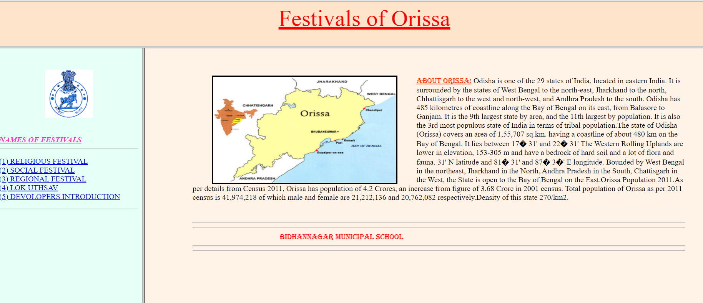
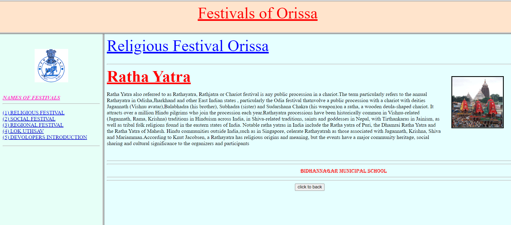
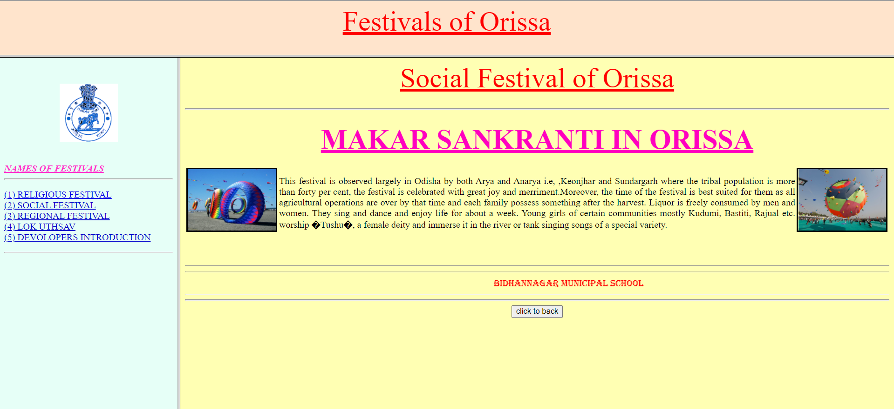
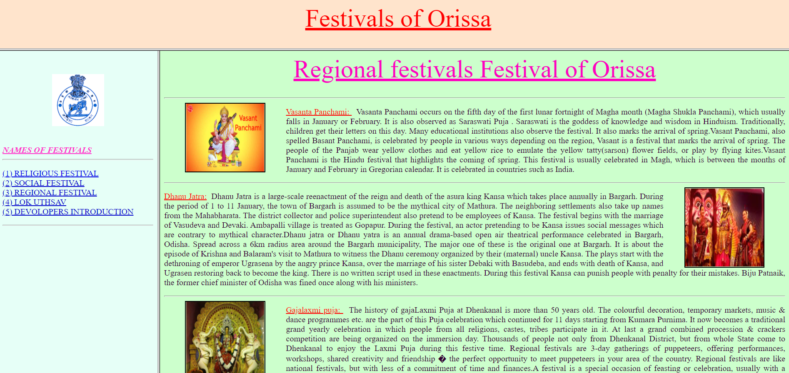
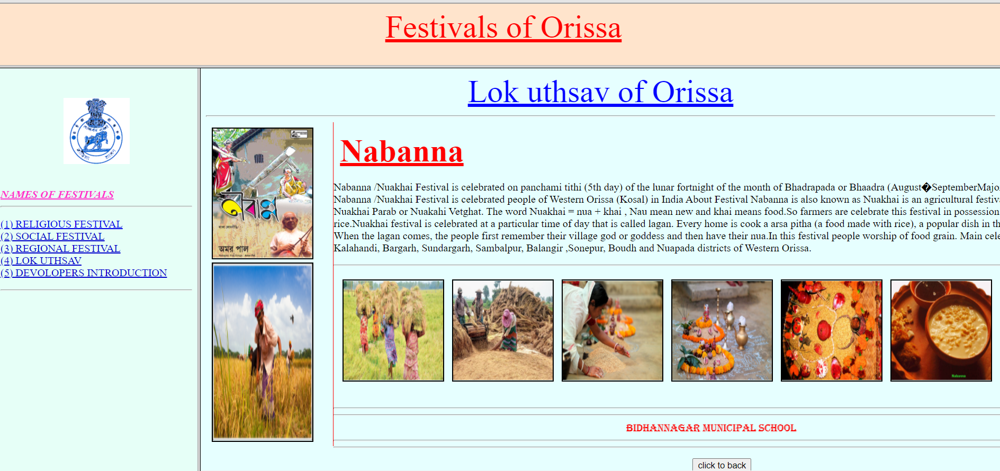

# ODISHA-FESTIVALS :star_struck:

[](https://shields.io/) [](https://shields.io/) [](https://shields.io/)

***This new Web application is created by Biswarup Bhattacharjee, student of BTECH, in University of Engineering and Management, Kolkata.***

**Email Id: bbiswa471@gmail.com.** 

**Contact No: 916290272740.** 

[](https://www.facebook.com/biswarup.bhattacharjee.5811) [](https://github.com/biswa2210)

## About :point_down: 
This is a website created by HTML only. Here are total five parts and introduction part. First is Religious Festival. Here we can know about Ratha Yatra. The second part, Social Festival contains description about Makar Sankranti. In the third part, Regional Festival part, we can find Vasanta Panchami, Dhanu Jatra, Gajalaxmi Puja, Raja Parba. In the fourth part, we can learn about Nabanna ,Lok Uthsav of Odisha. In the last part ,Developers Introduction, contains six names but the project is only developed by Biswarup Bhattacharjee. The other names are included just for project submission for HS exam. In this website we can easily learn about Odisha's festivals instead of searching them in other fields. The designs and divisions are made to make it user friendly.
## LINK of full project: :point_right: https://biswa2210.github.io/ODISHA-FESTIVALS/. 
## Purpose :point_down:

## Use :point_down:

## Importance :point_down:

## Folder Structure :point_down:
```bash
ODISHA-FESTIVALS
     ├── HOME2.html
     ├── LOK.html
     ├── REGI.html
     ├── SANK.html
     ├── def1.html
     ├── def2.html
     ├── def3.html
     ├── dev.html
     ├── index.html
     ├── link.html
     ├── mainpage.html
     ├── sank.html
     ├── rath.html
     ├── orri.html
     └── Lok.html
 ```               
## Making :point_down:

## Screenshots :point_down: 
<div align="center">
 <a href="ori1.PNG"></a> <a href="ori2.PNG"></a>

<a href="ori3.PNG"></a> <a href="ori4.PNG"></a>

<a href="ori5.PNG"></a>
</div>


